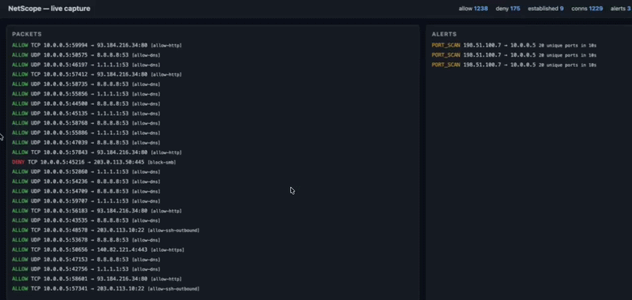

# NetScope

> Python packet analyzer, stateful firewall, and anomaly detector with a live web dashboard.



NetScope captures live network traffic, evaluates it against a YAML rule
engine with stateful connection tracking, runs sliding-window anomaly
detectors over the stream, and streams everything to a Flask + SSE dashboard
in real time.

It is intentionally compact (~1k LoC across five modules) so the architecture
is easy to read end to end.

---

## Architecture

```
                       +-----------------+
                       |    rules.yaml   |
                       +--------+--------+
                                |
                                v
   +-----------+      +------------------+      +---------------------+
   |  sniffer  | ---> |     firewall     | ---> |      dashboard      |
   |  (Scapy)  |      |  (rules + conn   |      |  (Flask + SSE +     |
   +-----+-----+      |   tracking)      |      |   stats endpoint)   |
         |            +--------+---------+      +----------+----------+
         |                     ^                           ^
         |                     | verdict events            | alert events
         |            +--------+---------+                 |
         +----------> |     anomaly      | ----------------+
                      |  (port scan,     |
                      |   SYN flood)     |
                      +------------------+
```

Each module is independent — `firewall.py` and `anomaly.py` have zero Scapy
imports and operate purely on the `Packet` dataclass. That keeps the test
suite fast and root-free.

| Module | Responsibility |
| --- | --- |
| `netscope/sniffer.py` | Wraps Scapy `sniff()`, parses Ether/IP/TCP/UDP/ICMP, exposes the immutable `Packet` view. |
| `netscope/firewall.py` | YAML-loaded rule engine. 5-tuple match with CIDR + port-range support. Stateful connection table with inline TTL expiry. |
| `netscope/anomaly.py` | Sliding-window detectors for port scans and SYN floods with per-source cooldown. |
| `netscope/dashboard.py` | Flask app: `/` HTML, `/stats` JSON, `/events` SSE. Thread-safe bounded event ring. |
| `netscope/main.py` | CLI + lifecycle: load rules, start dashboard thread, run blocking capture loop. |

---

## Features

- **Live capture** of Ethernet / IPv4 / TCP (with flag decode) / UDP / ICMP.
- **YAML rule engine** supporting `*`, CIDR blocks, port lists, and `lo-hi` ranges.
- **Stateful inspection**: reply traffic for an allowed flow is permitted automatically without an explicit inbound rule.
- **Sliding-window anomaly detection** for port scans (unique-port count) and SYN floods (raw-SYN burst).
- **Live web dashboard** over Server-Sent Events with a JSON stats endpoint and live packet + alert feeds.
- **Containerised** with a `python:3.12-slim` base, `libpcap` runtime, and clean `--cap-add=NET_RAW` guidance.
- **Pure-Python test suite** — runs without root or Scapy raw sockets.

---

## Quickstart

```bash
git clone <repo> netscope
cd netscope
python -m venv .venv && source .venv/bin/activate
pip install -r requirements.txt

# Run the test suite (no root needed)
pytest tests/ -v

# Run live (needs raw sockets)
sudo .venv/bin/python -m netscope.main --iface en0 --rules rules/rules.yaml

# Open the dashboard
open http://127.0.0.1:8080
```

### Demo mode (no sudo)

For a quick tour without raw-socket privileges, run the synthetic traffic
generator. It injects a realistic mix of allowed flows, blocked traffic, and
periodic port-scan bursts through the full pipeline:

```bash
.venv/bin/python -m netscope.demo
open http://127.0.0.1:8080
```

### Docker

```bash
docker build -t netscope .
docker run --rm -it \
    --cap-add=NET_RAW --cap-add=NET_ADMIN \
    --network host \
    -p 8080:8080 \
    netscope --iface eth0
```

---

## Configuring rules

Rules are evaluated top-to-bottom; first match wins. Anything not matched
falls through to `default`. Reply traffic for ALLOWed flows is handled by the
connection table — no inbound rules required.

```yaml
default: DENY
conn_ttl: 120

rules:
  - name: allow-dns
    action: ALLOW
    protocol: UDP
    dst_port: 53

  - name: allow-https
    action: ALLOW
    protocol: TCP
    dst_port: 443

  - name: block-smb
    action: DENY
    protocol: TCP
    dst_port: [139, 445]
```

Field reference:

| Field | Type | Notes |
| --- | --- | --- |
| `name` | string | Required. Shown in the dashboard as the matching rule. |
| `action` | `ALLOW` \| `DENY` | Required. |
| `protocol` | `TCP` \| `UDP` \| `ICMP` | Optional; omitted = any. |
| `src_ip` / `dst_ip` | literal or CIDR | `10.0.0.0/8`, `192.168.1.1`, omitted = any. |
| `src_port` / `dst_port` | int \| list \| `lo-hi` string | `443`, `[139, 445]`, `49152-65535`. |

---

## Technical notes

**Why inline TTL expiry?** I considered a background reaper thread for the
connection table but went with inline expiry on every `evaluate()` call:
for a single-threaded prototype it avoids a lock around the reaper, and the
overhead is O(n) connections per packet — fine at moderate capture rates.
A high-throughput deployment would want a dedicated reaper plus a more
compact representation (e.g. an LRU keyed on hashed 5-tuples).

**Reply traffic.** When a rule allows a packet, the 5-tuple is inserted in
the connection table. Subsequent packets are matched in both forward and
reversed orientations, which is how server-side reply packets bypass the
rule scan.

**Why decouple from Scapy?** The `Packet` dataclass is the only contact
surface with Scapy. Firewall and anomaly modules never import Scapy, so the
test suite constructs `Packet` objects directly — no root, no raw sockets,
no `libpcap`. CI runs in well under a second.

**Anomaly cooldowns.** Without per-source cooldowns, a scanner that crosses
the threshold trips an alert on every subsequent packet. The cooldown
suppresses alerts for a key until the window has rolled over far enough to
matter again.

**Stateless vs stateful.** Rule matching itself is stateless. The
connection table is a thin stateful layer on top — once a flow exists, it
short-circuits the rule scan. This mirrors how iptables/`conntrack` and
modern NGFWs are structured.

---

## Layout

```
netscope/
├── netscope/
│   ├── __init__.py
│   ├── sniffer.py        # capture + parse
│   ├── firewall.py       # rules + connection tracking
│   ├── anomaly.py        # port scan + SYN flood detectors
│   ├── dashboard.py      # Flask + SSE
│   └── main.py           # CLI entrypoint
├── rules/
│   └── rules.yaml
├── tests/
│   └── test_netscope.py  # 15+ unit tests, no root
├── Dockerfile
├── requirements.txt
└── README.md
```
